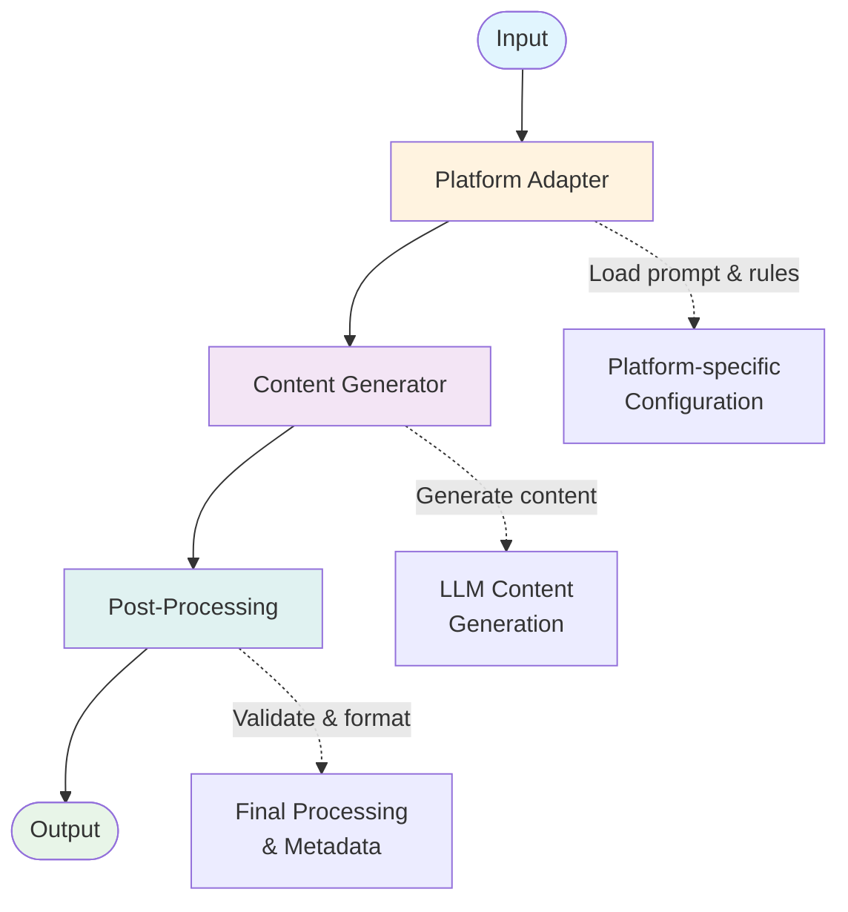

# Content Generator Agent

## 🌟 Overview

The Content Generator Agent is a specialized AI system that automatically creates high-quality, platform-specific content for influencer personas. It generates authentic content that maintains persona consistency while adapting to each platform's unique requirements.

**Current MVP Scope:** X (Twitter) tweets and LinkedIn text-only posts with a scalable architecture for future platform expansion.

---

## 🎯 Core Functionality

### What It Does
- **Accepts structured input**: `platform`, `content_type`, `topic`, `persona`, and `time`
- **Generates platform-optimized content**: Adapts writing style, length, and format per platform
- **Maintains persona authenticity**: Uses detailed persona profiles to ensure consistent voice and expertise
- **Produces structured output**: Ready for downstream validation, media generation, and publishing

### What It Doesn't Do
- Content validation (handled by Validation Agent)
- Media generation (handled by Media Builder Agent)  
- Content publishing (handled by Publishing Agent)
- Engagement tracking (handled by Feedback Agent)

---

## 🏗️ Architecture

### MVP Platforms & Content Types

| Platform | Supported Content Types | Character Limit | Hashtag Count |
|----------|------------------------|-----------------|---------------|
| **X (Twitter)** | `tweet` | 280 chars | 2 hashtags |
| **LinkedIn** | `text-only` | 1200 chars | 5 hashtags |

### Future-Ready Architecture
The system is designed for easy expansion. Adding new platforms or content types requires:
1. Adding to `PLATFORM_CONTENT_TYPES` mapping
2. Creating corresponding prompt template files
3. Updating platform rules (optional)

---

## � Workflow



### Processing Nodes

| Node | Purpose |
|------|---------|
| **Platform Adapter** | Loads platform-specific prompts and rules |
| **Content Generator** | Creates content using LLM with persona conditioning |
| **Post-Processing** | Validates length, trims if needed, determines media type |

---

## � Technical Components

### Core Tools
- **LLM Integration**: Groq API with Llama3 for content generation
- **Prompt System**: Platform and content-type specific templates
- **Rule Engine**: Platform constraints (length, hashtags, formatting)
- **Content Processing**: Length validation and intelligent trimming
- **Media Classification**: Determines if content needs visual elements

### Key Files
- `graph.py` - LangGraph workflow definition
- `components/state.py` - Data structure definitions
- `components/nodes.py` - Processing node implementations  
- `components/tools.py` - Utility functions and LLM tools
- `components/config.py` - Configuration management
- `prompts/` - Platform-specific prompt templates

---

## � Usage

### Input Format
```json
{
  "time": "2025-10-20T14:30:00Z",
  "platform": "X",
  "content_type": "tweet", 
  "topic": "Basic explanation of AI",
  "persona": {
    "Persona_ID": "Frank (AlgoWizard)",
    "Communication_Style": "Clear, pedagogic, subtle humor",
    "Tagline": "Simplifying AI for Africa"
  }
}
```

### Output Format
```json
{
  "content": "AI isn't magic, it's logic! Breaking down complex algorithms into simple terms for Africa and beyond",
  "hashtags": "#AfricanInnovation #AIforAll",
  "media_type": "none",
  "metadata": {
    "platform": "X",
    "content_type": "tweet",
    "persona": { /* full persona object */ },
    "topic": "Basic explanation of AI",
    "scheduled_time": "2025-10-20T14:30:00Z"
  }
}
```
