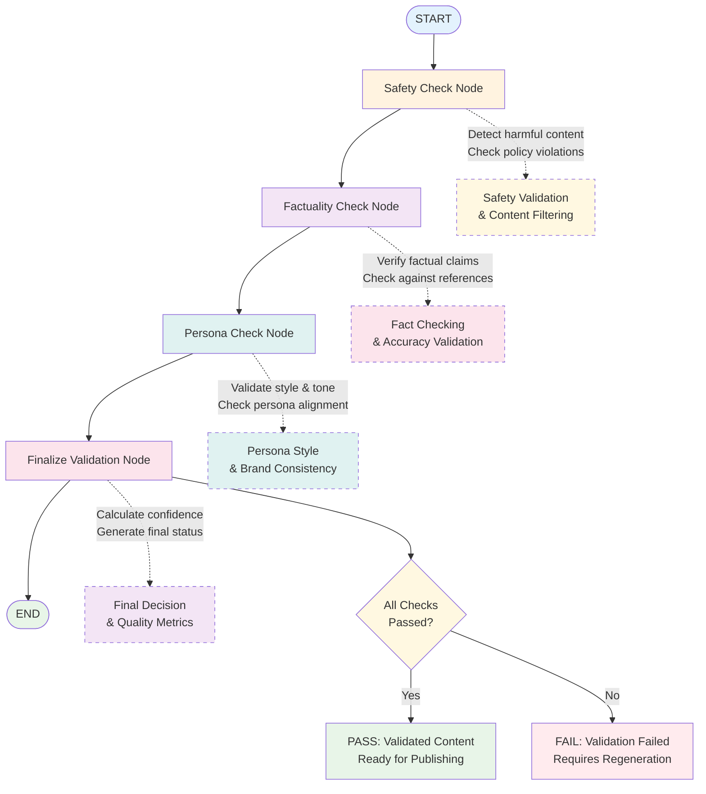

# Validation Agent

## 🌟 Problem Statement  

Content generation alone is not enough for scalable influencer automation.  
Even high-quality drafts may contain issues that:  

- Violate **safety & compliance policies** (toxicity, sensitive topics).  
- Contain **factual inaccuracies** that harm credibility.  
- Fail to match the **persona’s defined style/tone**.  

Without a **validation layer**, posts risk reputational damage, platform bans, or audience mistrust.  

---

## 💡 Agent Objective  

The Validation Agent ensures that **every draft generated** passes through a multi-layer quality gate:  

1. **Safety Check** → Filters unsafe, harmful, or disallowed content.  
2. **Factuality Check** → Confirms factual correctness using retrieval or heuristics.  
3. **Persona Style Check** → Enforces alignment with persona’s defined tone, vocabulary, and branding.  
4. **Final Decision** → Output validated draft or flag issues for regeneration.  

This guarantees content is **safe, accurate, and consistent with influencer identity** before proceeding to media creation or publishing.  

---

## 📂 Scope of Agent  

### ✅ The Agent WILL:
1. Accept **draft objects** from Content Generator (`content`, `metadata`, `media_required`).  
2. Run multi-step **validation checks** sequentially.  
3. Provide structured **feedback** if a draft fails validation.  
4. Pass only validated drafts forward to the Media Builder.  

### ❌ The Agent WILL NOT:
- Generate or rewrite drafts (handled by Content Generator).  
- Add media assets (handled by Media Builder).  
- Publish content (handled by Publishing Agent).  

---

## 📈 Execution Workflow  



---

## 🔹 Workflow Nodes

| Node Name                        | Functionality                                                                                    |
| -------------------------------- | ------------------------------------------------------------------------------------------------ |
| **Input Node**                   | Accepts structured draft JSON from Content Generator.                                            |
| **Safety Check Node**            | Uses safety prompts, heuristics, or moderation APIs to detect disallowed content.                |
| **Factuality Node**              | Cross-checks key claims against knowledge base, retrieval system, or heuristic fact-checking.    |
| **Persona Style Node**           | Ensures the draft matches persona tone, vocabulary, and branding.                                |
| **Output Node**                  | Returns either a validated draft or structured feedback for re-generation.                       |

---

## 🛠️ Tools Required

| Tool Name                   | Purpose                                                                     |
|-----------------------------|-----------------------------------------------------------------------------|
| **LLM API** | Run prompt-based safety/factuality/style checks.                            |
| **Safety Prompt Templates** | Define strict rules against toxicity, sensitive topics, policy violations.  |
| **Factuality Check Tools**  | Use retrieval augmentation or structured heuristic checks.                  |
| **Persona JSON Profiles**   | Provide style/tone/vocabulary reference.                                    |
| **Moderation/Filter API**   | Extra safeguard (e.g., OpenAI Moderation, Detoxify).                        |

---

## 📊 Expected Input & Output

### Input Example

```json
{
  "content": "Data analysts 🚀 ML can make your forecasts smarter...",
  "metadata": {
    "platform": "X",
    "persona": "Tech Mentor",
    "topic": "How data analysts can use ML for forecasting",
    "scheduled_time": "2025-09-12T09:00:00Z",
    "media_required": false
  }
}
```

### Output Example - Success ✅

```json
{
  "validated_content": "Data analysts 🚀 ML can make your forecasts smarter...",
  "metadata": {
    "platform": "X",
    "persona": "Tech Mentor",
    "topic": "How data analysts can use ML for forecasting",
    "scheduled_time": "2025-09-12T09:00:00Z",
    "media_required": false
  },
  "validation_status": "pass",
  "issues": []
}
```

### Output Example - Failure ❌

```json
{
  "validated_content": null,
  "metadata": {
    "platform": "X",
    "persona": "Tech Mentor",
    "topic": "How data analysts can use ML for forecasting"
  },
  "validation_status": "fail",
  "issues": [
    {
      "type": "factuality",
      "message": "Claim about decision trees improving time series forecasting is inaccurate."
    }
  ]
}
```

---

## 📏 Output (Hand-off to Validation Agent)

The final output is either:

* ✅ A validated draft object ready for Media Builder,
* ❌ Or a failure object with issue list → triggers regeneration loop in Content Generator.

The successful output is passed directly to the **Publishing Agent** for postings.
If validation fails, the generator re-enters the **rewrite loop**.
